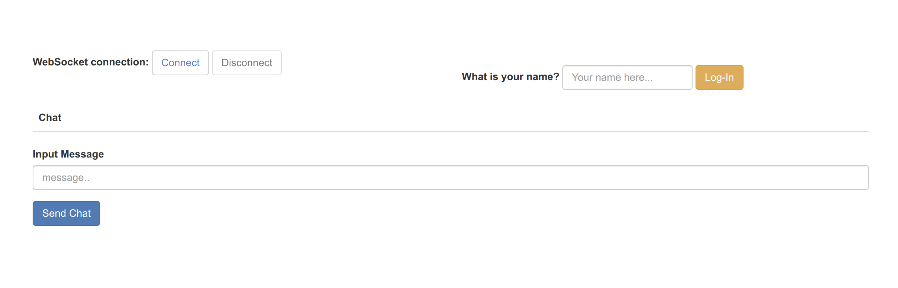

# WebSocket Chat

> Simple application to toy around with Spring WebSockets

 

`Spring Boot`   `WebSocket`   `Thymeleaf`    `Ajax`   `JQuery`   `Java`  `Sockjs`  `Stomp-Client`  

 

 

> Preview

 

> How to use

1. Connect to WebSocket

2. Type your name & Log-In

3. Enjoy Chatter 

[Link to this site](/chat-app/src/main/resources/templates/index.html)
